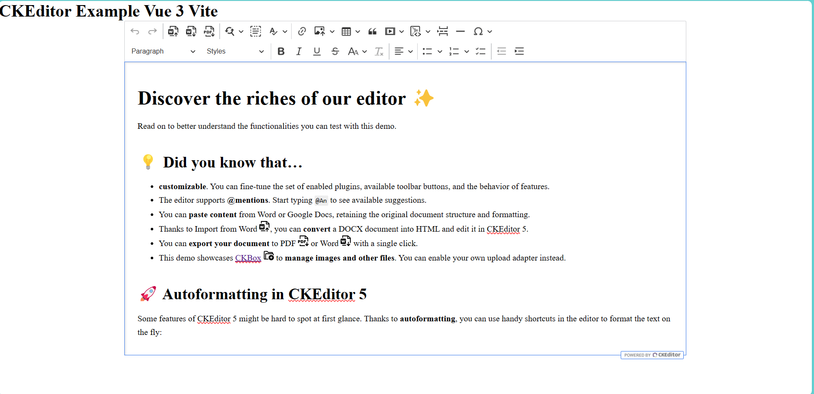

# CKEditor Vue 3 Vite Example

This README provides a quick guide to jumpstart your development using CKEditor within a Vue 3 project powered by Vite. Follow the steps below for a seamless setup and customization. Everything you need is [here](https://ckeditor.com/)



## Recommended IDE Setup

For an enhanced development experience, consider using the following tools:

1. **VSCode**: [Download VSCode](https://code.visualstudio.com/)
2. **Volar**: Install the Volar extension from the VSCode marketplace. You can find it [here](https://marketplace.visualstudio.com/items?itemName=Vue.volar). Additionally, disable Vetur if enabled.
3. **TypeScript Vue Plugin (Volar)**: Install this plugin from the VSCode marketplace. Find it [here](https://marketplace.visualstudio.com/items?itemName=Vue.vscode-typescript-vue-plugin).

## Customize configuration

See [Vite Configuration Reference](https://vitejs.dev/config/).

## Project Setup

```sh
npm install
```

### Compile and Hot-Reload for Development

```sh
npm run dev
```

### Compile and Minify for Production

```sh
npm run build
```
